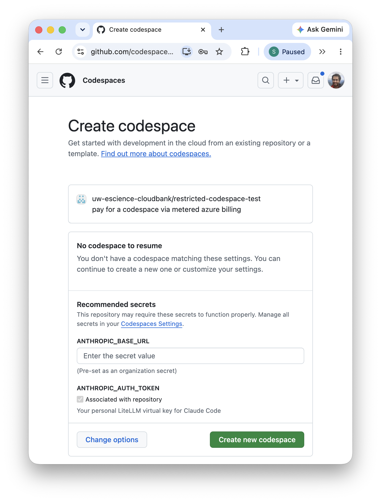

# restricted-codespace-test

☝️ Click the button above to open a [Codespace](https://github.com/features/codespaces) with a access to Anthropic Claude models. You must [create a codespace secret](https://docs.github.com/en/codespaces/managing-your-codespaces/managing-your-account-specific-secrets-for-github-codespaces) named `ANTHROPIC_AUTH_TOKEN` with your personal LiteLLM token (provided by organization admins). This token sets a budget for usage. When you launch the codespace for the first time you'll see the following, as long as you have the secret set and accessible by this repository, click the green launch button:

VSCode in the browser will open very quickly. However, it will take a minute or two to install various extensions and features.

## Additional Notes

A Codespace is an Azure Virtual Machine that is connected to UW eScience [SSEC LLMoxie](https://github.com/uw-ssec/llmoxie) gateway with provisioned access to Anthropic Models via AWS Bedrock running on a CloudBank Account.

☝️ Phew! That's a mouthful. But the point is that you can run VSCode in your browser and have access to Anthropic Claude models without having to install anything on your local machine.

Currently only two models are available:
- `cloudbank-claude-haiku-4-5` (Claude Haiku 4.5)
- `cloudbank-claude-sonnet-4-6` (Claude Sonnet 4.6)

**Important** if you 'Stop' the codespace, the state of your VM is preserved so that you can come back to it later. However, if you 'Delete' the codespace, it will be gone forever and you will have to start over. It's good practice to 'Stop' codespaces when you're done working because GitHub enforces quotas.

**Important** The GitHub *Copilot* extension also allows you to connect to Anthropic and other models, and enforces a monthly quota linked to your GitHub user account. Only `claude` in a terminal or the `claude-code` extension in VSCode will deduct from CloudBank and not your personal GitHub quota.

